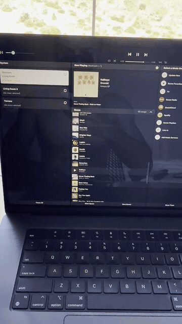
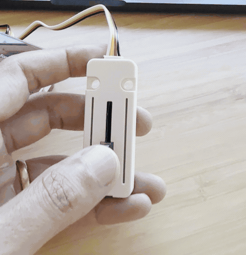

# Sonos ESP32 Remote

A physical Sonos remote built with an M5Stack CoreS3 and Unit Fader. It talks
to Sonos on your local network. You do not need Home Assistant or a cloud API.

## See it work

### Group all rooms



### Change the group volume



## Why I built this

I built a Sonos remote for the things I use most:

- Group all speakers with one touch.
- Control group volume with a physical volume control.
- Resume a previous session and pause.

I found it quite annoying to go into the app for this. On the Sonos speakers,
grouping is only possible when you go to one and long-hold the play button to
add it to the group, and there is no way to make the group volume higher.

## Quick start

Connect the CoreS3 to your computer with a USB-C **data cable**, open a terminal
in this project, and run:

```sh
python3 scripts/setup.py
```

The setup walks you through:

1. Your Wi-Fi name and password
2. Your Sonos coordinator room
3. The maximum allowed group volume
4. Building the firmware
5. Finding the USB port and flashing the CoreS3

Your password is hidden while you type. It is written only to an ignored local
file and is never printed by the setup script.

> [!IMPORTANT]
> The first installation is flashed over USB. Wi-Fi is used afterward to talk
> to Sonos; this version does not include wireless firmware updates.

## Connect the fader

Plug the Unit Fader's Grove cable into **Port B** on the CoreS3.

```text
Unit Fader                         CoreS3
┌─────────────┐   Grove cable    ┌─────────────┐
│ slider      ├─────────────────►│ Port B      │
│ two LED rows│                  │ GPIO 8: ADC │
└─────────────┘                  │ GPIO 9: RGB │
                                 └─────────────┘
```

This project is calibrated for the M5Stack Unit Fader on Port B:

- GPIO 8 reads the physical slider.
- GPIO 9 controls its 14 RGB LEDs.
- Moving upward means more volume.
- Full travel maps to the configured volume cap, not automatically to 100%.

## Manual setup

If you do not want to use the setup script:

1. Copy `include/wifi_credentials.example.h` to
   `include/wifi_credentials.h` and enter your Wi-Fi details.
2. Copy `include/device_settings.example.h` to
   `include/device_settings.h` and enter the exact Sonos room name and your
   preferred volume cap.
3. Install [PlatformIO](https://platformio.org/).
4. Build and flash:

```sh
pio run
pio run --target upload
pio device monitor --baud 115200
```

Both local configuration files are ignored by Git.

## Troubleshooting

### No USB port appears

Make sure the USB-C cable supports data, not only charging. Try another cable
or port. If upload does not start, hold RESET for about three seconds, release
it when the green LED lights, and retry.

### `Room not found`

The room must match the spelling and capitalization shown in the Sonos app.
Run the setup again with `python3 scripts/setup.py`. The serial monitor also
lists every room discovered by the remote.

### `No Sonos found` or network errors

- The CoreS3 and Sonos players must be on the same local network.
- Guest Wi-Fi and client isolation can prevent local device discovery.
- Check the Wi-Fi credentials and restart the CoreS3.
- Confirm that the chosen room is online and visible in the Sonos app.

### Group volume does not work

Select the room that should be the group coordinator, then tap **GROUP ALL**.
The group-volume endpoint belongs to the coordinator.

## Security

- `include/wifi_credentials.h` is ignored and must never be committed.
- `include/device_settings.h` is also ignored.
- Wi-Fi credentials are compiled into the device firmware. Anyone with
  physical access and sufficient hardware knowledge may be able to extract
  them; do not treat the device as a secure credential store.
- The remote makes local, unencrypted HTTP requests to Sonos on your LAN.

## Development

The firmware uses the Arduino framework through PlatformIO. Dependencies are
pinned in `platformio.ini` for reproducible builds. Coding agents should read
`AGENTS.md` before changing or flashing the project.

## What you need

- **M5Stack CoreS3 ESP32-S3 development kit**
- **M5Stack Unit Fader (U123)** with its Grove cable, connected to **Port B**
- A USB-C **data** cable for the first flash
- One or more Sonos speakers on the same local Wi-Fi network
- A computer with Python 3 and PlatformIO
